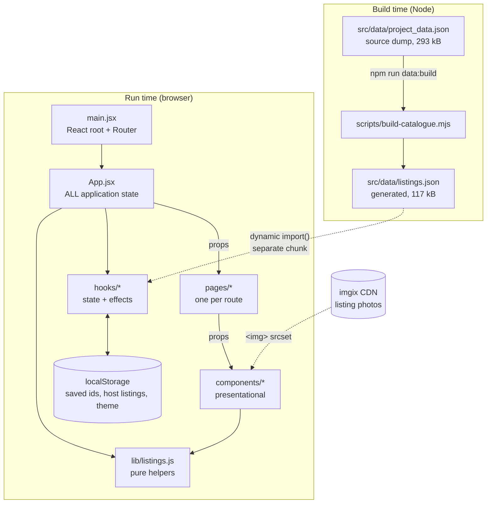
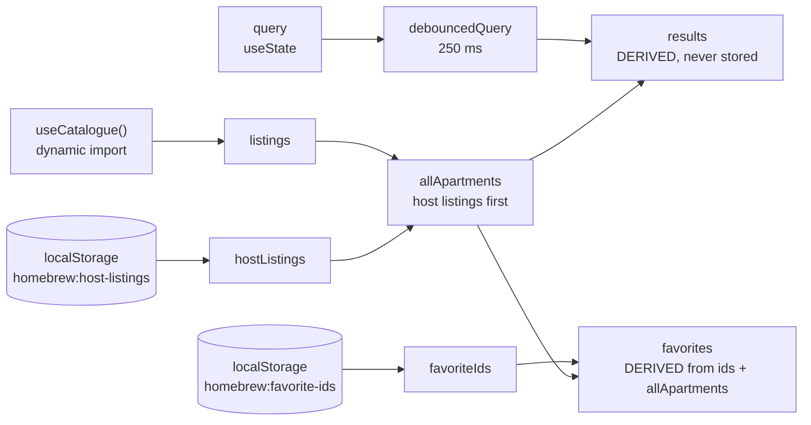
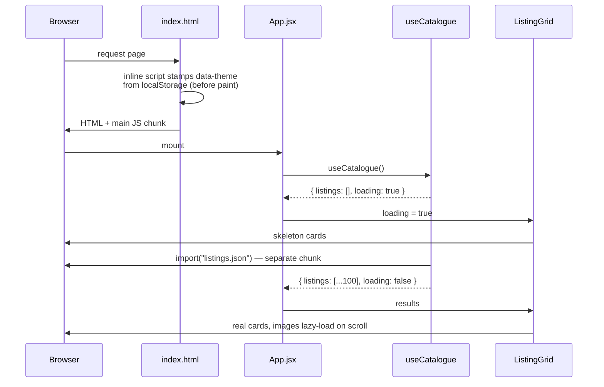
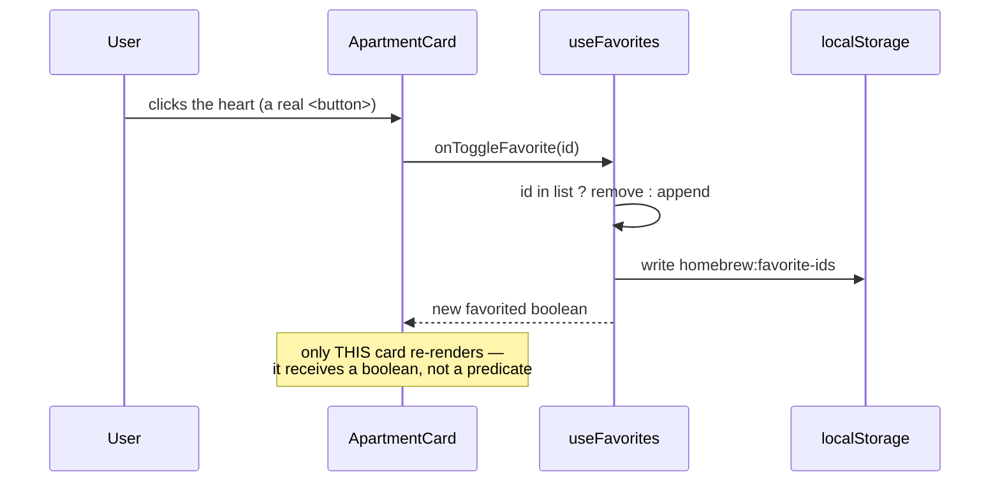

# Architecture

How Homebrew Apartments fits together, why it is built this way, and where to look
when you want to change something.

New to the repo? Read [README.md](./README.md) first for setup, then this.

> **A note on inference.** Statements marked _(inferred)_ are conclusions drawn
> from reading the code, not from any written record of the original intent.
> Everything else is directly observable in the source.

---

## 1. The shape of the system

There is no server. The whole application is static files served to a browser:



The only network requests after first paint are the catalogue chunk and the
listing photographs. **imgix** is the image CDN that hosts the catalogue's photos;
it accepts sizing parameters in the URL query string, which the app exploits to
request appropriately sized images (see §5).

---

## 2. Layers, and the one rule that holds them apart

| Layer | Location | Owns | Must not |
| --- | --- | --- | --- |
| **Root state** | `src/App.jsx` | Every piece of shared state | Render listing markup |
| **Hooks** | `src/hooks/` | Stateful behaviour, effects, storage | Render anything |
| **Pages** | `src/pages/` | Route-level layout, page title | Own shared state |
| **Components** | `src/components/` | Presentation and local UI state | Reach for global state |
| **Helpers** | `src/lib/` | Pure functions over a listing record | Touch React or the DOM |

`src/lib/listings.js` is deliberately free of React imports, which is why it is the
easiest part of the codebase to test.

**State lives in exactly one place: `App.jsx`.** There is no Context, no Redux, no
Zustand. State is passed down as props, at most two levels deep. _(Inferred: for an
app with six routes and one shared entity, prop-drilling two levels is less
machinery than a store, and it keeps the data flow readable in a single file.)_

---

## 3. Application state

Everything in `App.jsx`, in dependency order:



Three things are worth internalising:

**`results` is derived, not stored.** It is a `useMemo` over `allApartments` and the
debounced query. An earlier version kept the filtered array in its own `useState`
and updated it only on <kbd>Enter</kbd>, so what you typed and what you saw could
disagree. Deriving it makes that class of bug impossible.

**Favorites are stored as ids, not as listing objects.** `localStorage` holds an
array of id strings; the listing objects are looked up from `allApartments` on
each render. Storing copies would mean a saved listing could go stale, and it would
duplicate the catalogue in storage.

**Only host-created listings are persisted.** The catalogue already ships with the
app, so writing a second copy into `localStorage` would waste the quota for no gain.

### Two invariants that were each a real bug

1. **Look listings up in `allApartments`, never in `results`.**
   `results` is a filtered view. When `ApartmentDetails` searched it instead of the
   full catalogue, opening a listing that the active search excluded — a saved
   listing in another city, a shared link — resolved to `undefined` and threw,
   blanking the entire app. Guarded by a test.

2. **`filterListings` returns the *same array reference* for an empty query.**
   `ApartmentCard` is memoized; a fresh array every render would defeat it. Also
   guarded by a test.

---

## 4. Lifecycles

### First load



The inline theme script in `index.html` runs **before** React mounts. Without it a
dark-mode visitor would see a flash of the light palette while the JS chunk parses.

Because the catalogue is an async import, `loading` is threaded down to the
listings, saved and detail pages. `ApartmentDetails` in particular must
distinguish _"not loaded yet"_ from _"no such listing"_ — otherwise opening a link
directly flashes "that stay isn't available" before the data arrives.

### Typing a search

```mermaid
sequenceDiagram
    participant U as User
    participant S as SearchBar
    participant A as App.jsx
    participant L as CityLedger
    participant G as ListingGrid

    U->>S: types "ber"
    S->>A: setQuery("ber")
    Note over A: input updates immediately;<br/>filtering waits 250 ms
    A->>A: useDebouncedValue settles
    A->>A: filterListings(allApartments, "ber")
    A->>L: results
    L->>U: per-city counts update (Berlin 9, others 0)
    A->>G: results
    G->>U: filtered grid, or empty state
```

`CityLedger` and `ListingGrid` read the *same* `results` array, which is why the
counts and the grid can never disagree.

### Saving a listing



`ApartmentCard` receives `favorited` as a **boolean**, never the `isFavorite`
function. The function's identity changes on every toggle, so passing it would
re-render all 100 cards and make `memo` useless.

---

## 5. Design decisions

| Decision | Why |
| --- | --- |
| Catalogue loaded via `import()` | Keeps ~117 kB out of the initial chunk; nothing on the landing page needs it. Also gives the grid a genuine loading state rather than a decorative one. |
| A generated `listings.json` alongside the dump | ~60% of the dump is never rendered. The generator drops it at build time while the dump stays as the source of record. |
| CSS Modules, not global CSS | Two stylesheets used to each set `body {}` and one set `* { font-family }`, so the rendered result depended on import order. Scoping makes that impossible. _(Inferred from the git history of the CSS files.)_ |
| Design tokens in one file | Replaced 20+ hard-coded colour literals and 10 ad-hoc font sizes, and is what makes dark mode a palette swap rather than a rewrite. |
| System font for UI, webfont only for display | EB Garamond carries the wordmark and every number; UI text uses the system stack, which costs nothing to fetch and needs no swap. |
| `srcset` built by rewriting imgix params | The photo URLs already carry `w`/`h`/`q`, so extra sizes cost only a rewritten query string. Non-imgix URLs (host-created listings) pass through untouched. |
| No component library | _(Inferred)_ Nothing in the repo suggests one was ever used; the components are small enough that a dependency would not pay for itself. |

### Styling contract

Read [`src/styles/README.md`](./src/styles/README.md) before touching CSS. The
short version:

- `tokens.css` holds every colour, size, space and radius. **No raw hex values or
  magic pixel numbers anywhere else.**
- `base.css` is **the only file allowed to style bare elements.**
- Everything else is `*.module.css`, and **bare element selectors inside a module
  are not scoped** — they leak globally. Always give the element a class.

---

## 6. Where do I look if I want to change X?

| I want to… | Go to |
| --- | --- |
| Change what search matches on | `filterListings` in `src/lib/listings.js` |
| Change the search debounce delay | The `useDebouncedValue(query, 250)` call in `src/App.jsx` |
| Add or change a route | `src/App.jsx` (routes) plus a new file in `src/pages/` |
| Change what a listing card shows | `src/components/ApartmentCard.jsx` |
| Change the listing detail layout | `src/components/Details.jsx` |
| Change the grid, skeleton or empty state | `src/components/ListingGrid.jsx` |
| Change the per-city counts above the grid | `src/components/CityLedger.jsx` |
| Change any colour, spacing or font size | `src/styles/tokens.css` — and only there |
| Change dark-mode behaviour | `src/hooks/useTheme.js` + the dark blocks in `tokens.css` + the inline script in `index.html` |
| Change what fields a listing carries | `KEEP` in `scripts/build-catalogue.mjs`, then `npm run data:build` |
| Change the publish-a-listing form | `src/pages/AddApartmentPage.jsx` (the `SECTIONS` array drives the fields) |
| Change what persists between visits | `src/hooks/useFavorites.js` and the `useLocalStorage` calls in `src/App.jsx` |
| Change the page `<title>` for a route | The `useDocumentTitle(...)` call in that page component |
| Add a test | Next to the file under test, as `*.test.js(x)` |

---

## 7. Testing

Vitest in a jsdom environment, with `src/test/setup.js` clearing `localStorage`
before each test and stubbing the layout APIs jsdom lacks.

The suite deliberately covers **defects that actually occurred** rather than
framework behaviour — each test names the bug it guards. If you fix a bug, add a
test in that style.

Current coverage: the pure helpers in `src/lib/listings.js`, the `useFavorites` and
`useLocalStorage` hooks, and the `ApartmentDetails` loading / not-found / found
branches.

---

## 8. Known gaps

- **`src/assets/EBGaramond-SemiBold.ttf` is 562 kB**, the largest asset in the
  project. Converting it to WOFF2 and subsetting it would cut it substantially, but
  needs `fonttools` or `woff2_compress`, which are not part of the toolchain.
- **No error boundary.** A render error in a page unmounts the whole app.
- **Tests cover logic, not flows.** There is no test that drives search → grid →
  detail → save end to end.
