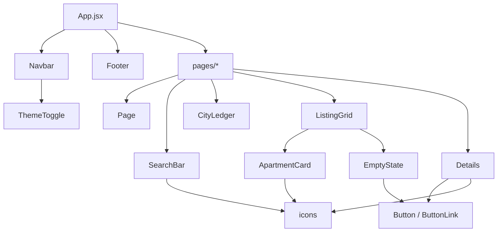

# Components

Reusable UI. These are presentational: they receive data and callbacks as props
and own only local UI state (an image's loaded flag, a description's expanded
flag). None of them read shared state directly — it all arrives from `App.jsx`
through a page.

| Component | Role |
| --- | --- |
| `Page` | The shared page container: max width, horizontal padding |
| `Navbar` | Sticky header — wordmark, route links, theme toggle |
| `Footer` | Site footer — copyright, social links |
| `ThemeToggle` | Light/dark switch; the only consumer of `useTheme` |
| `SearchBar` | Controlled text input for the query |
| `CityLedger` | Live per-city result counts; also the filter chips and reset |
| `ListingGrid` | The card grid, the loading skeleton, or an empty state |
| `ApartmentCard` | One listing in the grid. Memoized |
| `Details` | The full listing detail view |
| `EmptyState` | Title + description + action, for "nothing here" screens |
| `Button` | `Button` and `ButtonLink`, sharing one set of styles |
| `icons` | Inline SVG icon set |

---

## Composition

---

## Conventions

**Icons are inline SVG, not image files.** `icons.jsx` exports small components
that take their colour from `currentColor`, so they follow the theme and can show
state (a filled versus outlined heart) without loading a second asset. They are
`aria-hidden` — the accessible name belongs on the button wrapping them.

**Interactive things are real elements.** Buttons are `<button>`, links are `<a>`
or React Router's `<Link>`. Never a click handler on an `` or `
`: those
are not focusable, not keyboard-operable and announce nothing. Toggles carry
`aria-pressed` and an accessible name that reflects the current state
("Save X" versus "Remove X from saved").

**Images reserve their space.** Every `` carries `width`/`height` or sits in
an `aspect-ratio` box so the grid does not reflow as photos arrive, plus
`loading="lazy"` unless it is above the fold. Build `srcset` with `imageSrcSet`
from `src/lib/listings.js` rather than hand-writing URLs.

**`ApartmentCard` takes a boolean, not a predicate.** It receives
`favorited={true|false}`, never the `isFavorite` function. The function's identity
changes on every toggle, which would re-render all 100 cards and make its `memo`
wrapper pointless. If you add props to this component, keep them referentially
stable for the same reason.

**Empty states take an action.** `EmptyState` has an `action` slot, and every use
fills it. A screen with nothing on it should offer a way forward, not just report
the absence.

See [`../styles/README.md`](../styles/README.md) for the CSS Modules conventions
these components follow.
