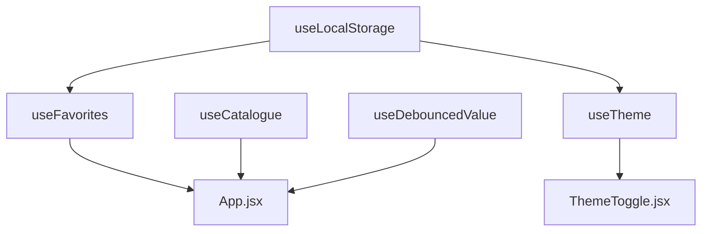

# Hooks

Custom React hooks. Every piece of stateful behaviour that is not simply "this
component's local UI state" lives here, which keeps `App.jsx` readable as a map of
what the app knows rather than a pile of effects.

All of these are called from `src/App.jsx` or from a page component. None of them
render anything.

| Hook | Responsibility |
| --- | --- |
| `useCatalogue` | Dynamically imports the listing catalogue; reports loading and error |
| `useLocalStorage` | `useState` that mirrors to `localStorage`, degrading safely |
| `useFavorites` | The single source of truth for saved listings |
| `useDebouncedValue` | Trails a fast-changing value, used for the search input |
| `useTheme` | Light/dark/system theme, stamped onto `<html>` |
| `useDocumentTitle` | Per-route `<title>` |
| `useScrollToTop` | Scrolls to the top on mount |

---

## Composition

`useFavorites` is built on `useLocalStorage`, and `useTheme` is too:

`useTheme` is called by `ThemeToggle`, not by `App`, because nothing else needs it.

---

## Conventions

**Storage keys are namespaced** with a `homebrew:` prefix so they cannot collide
with anything else on the origin:

| Key | Written by | Holds |
| --- | --- | --- |
| `homebrew:favorite-ids` | `useFavorites` | Array of listing id strings |
| `homebrew:host-listings` | `App.jsx` via `useLocalStorage` | Array of user-created listing objects |
| `homebrew:theme` | `useTheme` | `"light"`, `"dark"` or `"system"` |

> If you change a key, update the matching string in the inline theme script in
> `index.html` — it reads `homebrew:theme` directly, before React exists.

**Storage access is always guarded.** `localStorage` can throw on *access*, not
just on write: private-browsing modes and "block site data" settings make the
accessor itself raise. `useLocalStorage` wraps both read and write in `try/catch`
and falls back to in-memory state, so a blocked browser gets a degraded feature
rather than a blank page. There are tests for both failure paths.

**Effects clean up after themselves.** `useCatalogue` guards against setting state
after unmount with a `cancelled` flag; `useDebouncedValue` clears its timer;
`useTheme` removes its media-query listener.
